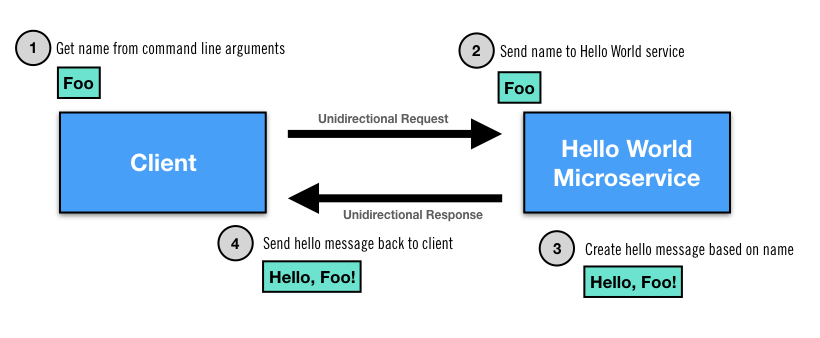

# proteus-springboot-example

A simple example of integrating [Spring Boot](https://spring.io/projects/spring-boot) and [Netifi Proteus](https://www.netifi.com) to create request/reply interactions with microservices.

## Prerequisites
This example requires the following prerequisites:

1. Protocol Buffers Compiler

    You can download the compiler from here: https://github.com/google/protobuf/releases
    
    OR
    
    If you are on a mac using homebrew you can install it with the following command:
    
        $ brew install protobuf

2. A running instance of the Proteus Broker
    You can pull the latest Proteus Broker from DockerHub using the following command:
    
            $ docker pull netifi/proteus
    
    Start the Proteus Broker by running the following command:
    
            $ docker run -p 8001:8001 -p 7001:7001 -e BROKER_SERVER_OPTS='-Dnetifi.authentication.0.accessKey=3006839580103245170 -Dnetifi.authentication.0.accessToken=SkOlZxqQcTboZE3fni4OVXVC0e0=' netifi/proteus

## Running the Example

## Bugs and Feedback
For bugs, questions, and discussions please use the [Github Issues](https://github.com/gregwhitaker/proteus-springboot-example/issues).

## License
Copyright 2018 [Netifi Inc.](https://www.netifi.com)

Licensed under the Apache License, Version 2.0 (the "License");
you may not use this file except in compliance with the License.
You may obtain a copy of the License at

   http://www.apache.org/licenses/LICENSE-2.0

Unless required by applicable law or agreed to in writing, software
distributed under the License is distributed on an "AS IS" BASIS,
WITHOUT WARRANTIES OR CONDITIONS OF ANY KIND, either express or implied.
See the License for the specific language governing permissions and
limitations under the License.